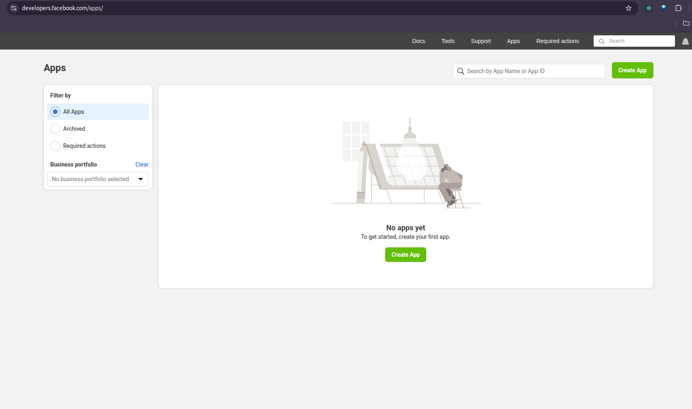
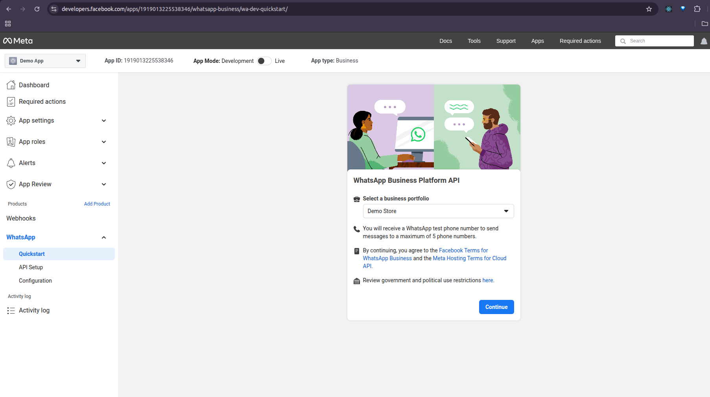
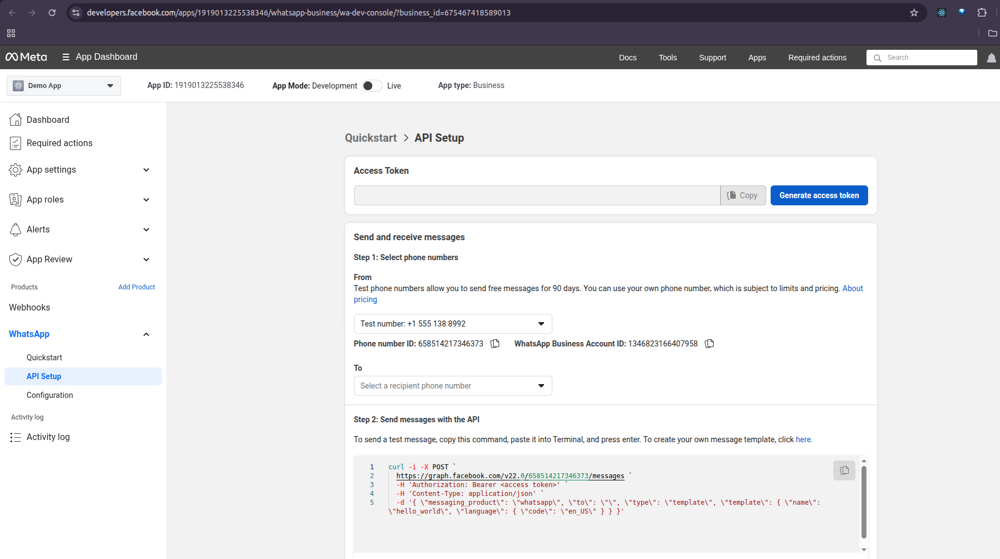
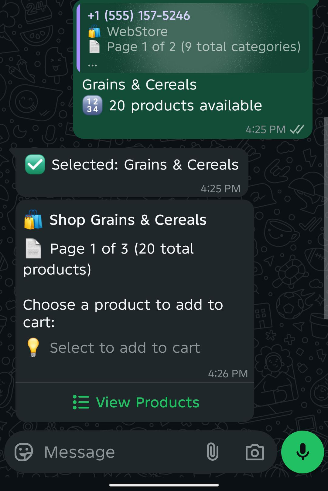

# WhatsApp Business API Integration - Complete Setup Guide

A comprehensive guide to integrate WhatsApp Business API with your Spring Boot eCommerce application, enabling customers to browse products and complete purchases directly through WhatsApp.

## 🌟 Overview

This integration creates an interactive shopping experience where customers can:
- Browse product categories through WhatsApp buttons
- View products and pricing information
- Add items to cart and complete purchases
- Receive order confirmations and updates
- All without leaving WhatsApp

## 🏗️ System Architecture

```
┌─────────────────┐    ┌──────────────────┐    ┌─────────────────────┐
│   WhatsApp      │    │   Spring Boot    │    │    PostgreSQL       │
│   Business API  │◄──►│   Application    │◄──►│    Database         │
│                 │    │                  │    │                     │
│ • Send Messages │    │ • Process Logic  │    │ • Categories        │
│ • Receive Hooks │    │ • Handle Buttons │    │ • Products          │
│ • Interactive   │    │ • Database Ops   │    │ • Pricing           │
│   Components    │    │                  │    │ • Orders            │
└─────────────────┘    └──────────────────┘    └─────────────────────┘
         ▲                       ▲
         │                       │
    ┌────▼────┐             ┌────▼────┐
    │  Ngrok  │             │Postman  │
    │(Webhook)│             │(Testing)│
    └─────────┘             └─────────┘
```

## 📋 Prerequisites

Before starting, ensure you have:
- Spring Boot application running
- PostgreSQL database setup
- Business phone number (for WhatsApp Business)
- Valid email address
- Ngrok installed for local testing


## 📦 Project Dependencies

This Spring Boot application uses the following key dependencies:

### ✅ Core Frameworks & APIs
| Dependency                            | Purpose                                                  |
|---------------------------------------|----------------------------------------------------------|
| `spring-boot-starter-web`            | Create REST APIs with embedded Tomcat server             |
| `spring-boot-starter-data-jpa`       | Simplify JPA-based persistence                           |
| `jakarta.persistence-api`            | JPA annotations and APIs                                 |
| `jakarta.validation-api`             | Bean validation specification                            |
| `hibernate-validator`                | Reference implementation for Jakarta Bean Validation     |
| `spring-boot-starter-security`       | Add authentication and authorization support             |
| `spring-web`                         | Spring's core web module                                 |

### 🛠 Database & Migration
| Dependency                            | Purpose                                                  |
|---------------------------------------|----------------------------------------------------------|
| `flyway-core`                         | Database versioning and migration                        |
| `flyway-database-postgresql`         | PostgreSQL-specific Flyway support                       |
| `postgresql`                          | JDBC driver for PostgreSQL                               |

### 🔐 Utilities
| Dependency                            | Purpose                                                  |
|---------------------------------------|----------------------------------------------------------|
| `okhttp3`                             | HTTP client for API calls                                |
| `lombok`                              | Reduce boilerplate (getters, setters, constructors, etc) |

### 🧪 Testing & Coverage
| Dependency                            | Purpose                                                  |
|---------------------------------------|----------------------------------------------------------|
| `spring-boot-starter-test`           | Spring Boot testing support                              |
| `junit-jupiter`                      | JUnit 5 for unit testing                                 |
| `mockito-core` / `mockito-junit-jupiter` | Mocking framework for unit tests                       |
| `spring-security-test`               | Test support for Spring Security                         |
| `junit-platform-launcher`            | JUnit platform support                                   |
| `jacoco.agent`                       | Code coverage agent for JaCoCo                           |


## 🚀 Step-by-Step Setup

### Step 1: Create Meta Developer Account

1. Visit [Meta for Developers](https://developers.facebook.com/)
2. Click **"Get Started"** and sign up with your email
3. Complete account verification
4. Create or connect a Meta Business account when prompted


### Step 2: Create New Meta App

1. Go to [App Dashboard](https://developers.facebook.com/apps/)
2. Click **"Create App"**
3. Select **"Business"** as app type
4. Fill in app details:
   - **App Name**: "YourStore WhatsApp Integration"
   - **Contact Email**: Your business email
5. Click **"Create App"**



### Step 3: Add WhatsApp Product

1. From your app dashboard, find **"Add Products"**
2. Locate **"WhatsApp"** and click **"Set Up"**
3. Click **"Get Started"** in WhatsApp configuration
4. Connect your WhatsApp Business account or create new one



### Step 4: Configure WhatsApp Business Number

1. In WhatsApp configuration, click **"Manage phone numbers"**
2. Add your business phone number
3. Verify with the SMS code received
4. Note down the **Phone Number ID** (you'll need this later)


### Step 5: Collect API Credentials

From the WhatsApp configuration page, collect these important values:

1. **API URL**: `https://graph.facebook.com/v22.0`
2. **Phone Number ID**: Found under "From" section
3. **Access Token**: Click "Generate" in API Setup section
4. **Business Account ID**: Found in business settings
5. **Verify Token**: Create your own secure string (e.g., `webstore-verify-2024`)



### Step 6: Configure Your Spring Boot Application

Add these properties to `application.properties`:

```properties
# WhatsApp Business API Configuration
whatsapp.api-url=https://graph.facebook.com/v22.0
whatsapp.phone-number-id=YOUR_PHONE_NUMBER_ID
whatsapp.access-token=YOUR_ACCESS_TOKEN
whatsapp.verify-token=webstore-verify-2024
whatsapp.business-account-id=YOUR_BUSINESS_ACCOUNT_ID

# Server Configuration
server.port=8080
```

### Step 7: Setup Webhook with Ngrok

1. **Start your Spring Boot application**:
   ```bash
   mvn spring-boot:run
   ```

2. **Start Ngrok in separate terminal**:
   ```bash
   ngrok http 8080
   ```

3. **Copy the HTTPS URL** from Ngrok output (e.g., `https://abc123.ngrok.io`)


4. **Configure webhook in Meta Dashboard**:
   - Go to WhatsApp > Configuration > Webhooks
   - Click **"Configure"** or **"Add Webhook"**
   - **Webhook URL**: `https://your-ngrok-url.ngrok.io`
   - **Verify Token**: `webstore-verify-2024` (same as in properties)
   - **Subscribe to**: Select "messages" field
   - Click **"Verify and Save"**


### Step 8: Add Test Phone Numbers

1. Go to WhatsApp > Configuration > **Test Numbers**
2. Click **"Manage"** and add up to 5 phone numbers
3. Each number will receive a verification code
4. These numbers can now interact with your WhatsApp bot


## 🔗 API Endpoints Reference

### 1. Welcome Message
```http
POST /v22.0/{phoneNumberId}/send-welcome-template/messages
Content-Type: application/json

{
    "to": "+919876543210"
}
```

### 2. Show Categories
```http
POST /v22.0/{phoneNumberId}/send-category-interactive/messages?phone=+919876543210
```

### 3. Show Products in Category
```http
POST /v22.0/{phoneNumberId}/send-product-interactive/messages?phone=+919876543210&categoryName=Electronics
```

### 4. Show Product Details
```http
POST /v22.0/{phoneNumberId}/send-one-product-interactive/messages?phone=+919876543210&productName=iPhone
```

### 5. Show Product Price
```http
POST /v22.0/{phoneNumberId}/show-product-price-interactive/messages?phone=+919876543210&productName=iPhone
```

### 6. Send Text Message
```http
POST /v22.0/{phoneNumberId}/send-text/messages?phone=+919876543210&message=Hello from API
```

## 🎯 Complete User Experience Flow

### Step-by-Step Customer Journey

1. **Welcome Message** → Customer receives welcome with action buttons
   

2. **Browse Categories** → Customer sees product categories as buttons
   

3. **View Products** → Customer browses products in selected category
   

4. **Product Details** → Customer views detailed product information
   

5. **Add to Cart** → Customer adds items and views cart
   
   

## 🔧 Troubleshooting

### Common Issues and Solutions

#### Webhook Verification Fails
- **Check**: Verify token matches exactly in both Meta Dashboard and application.properties
- **Check**: Server is publicly accessible via Ngrok
- **Check**: Application logs for incoming verification requests

#### Messages Not Being Received
- **Check**: Webhook subscription includes "messages" field
- **Check**: Application logs for webhook events
- **Check**: Phone number is added to test numbers list

#### No Response to Messages
- **Check**: Access token is valid and not expired
- **Check**: Phone Number ID is correct
- **Check**: API error responses in application logs

#### Ngrok Connection Issues
- **Solution**: Restart Ngrok and update webhook URL
- **Solution**: Check Ngrok account limits (free tier has restrictions)

## 📊 Performance & Best Practices

### Rate Limiting
- **WhatsApp Limit**: 1000 messages per second
- **Implement**: Request throttling in your application
- **Monitor**: Message delivery status and errors

### Security Best Practices
1. **Never expose** access tokens in client-side code
2. **Validate** all incoming webhook requests
3. **Use HTTPS** for all webhook URLs
4. **Rotate** access tokens regularly

### Message Guidelines
1. **24-Hour Rule**: Free-form messaging within 24 hours of user message
2. **Templates**: Required for messages outside 24-hour window
3. **User Consent**: Always get explicit opt-in before messaging
4. **Content Policy**: Follow WhatsApp's commerce and messaging policies

**Happy Coding! 🚀**

*This guide combines setup, configuration, testing, and best practices into one comprehensive resource for beginners.*