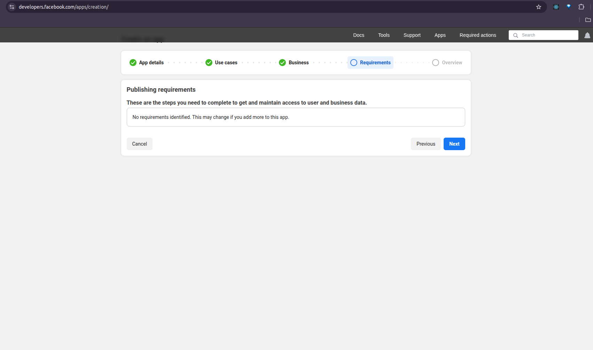

# Setting Up WhatsApp Business API

This research spike walks you through setting up WhatsApp Business API.

It uses Meta's Cloud API solution, which is the recommended approach for new integrations.

## 1. Create a Meta Developer Account

1. Visit [Meta for Developers](https://developers.facebook.com/) and sign up or log in 


2. If you don't have a Meta Business account, you'll be prompted to create one

## 2. Create a Meta App

1. Go to the [Meta for Developers App Dashboard](https://developers.facebook.com/apps/)
2. Click "Create App"
3. Select "Business" as the app type
4. Enter your app name and contact email
5. Click "Create App"





## 3. Add WhatsApp to Your App

1. From your app dashboard, click "Add Products"
2. Find "WhatsApp" and click "Set Up"
3. You'll be taken to the WhatsApp configuration page


## 4. Set Up WhatsApp Business Account

1. In the WhatsApp configuration page, click "Get Started"
2. Connect an existing WhatsApp Business account or create a new one
3. Follow the prompts to verify your business phone number

## 5. Configure Webhooks

1. In your app dashboard, navigate to "WhatsApp" > "Configuration"
2. Find the "Webhooks" section and click "Configure"
3. Enter your Ngrok URL followed by the webhook path:
   ```
   https://YOUR_NGROK_URL/api/webhook/whatsapp
   ```
4. Enter your verify token (the same one you set in your Spring Boot application)
5. Select the fields you want to subscribe to:
    Example: - messages
6. Click "Verify and Save"


## 6. Obtain Access Credentials

1. In your app dashboard, navigate to "WhatsApp" > "Configuration"
2. Copy the following values to use in your application:
    - **Phone Number ID**: Found under the "From" section
    - **Access Token**: In the "API Setup" section, click "Generate" to create a new token
    - **Business Account ID**: The ID of your connected WhatsApp Business Account


## 7. Update Your Application Properties

Update your Spring Boot application's `application.properties` with these values:

```properties
whatsapp.api-url=https://graph.facebook.com/v17.0
whatsapp.phone-number-id=YOUR_PHONE_NUMBER_ID
whatsapp.access-token=YOUR_ACCESS_TOKEN
whatsapp.verify-token=YOUR_VERIFY_TOKEN
whatsapp.business-account-id=YOUR_BUSINESS_ACCOUNT_ID
```

## 8. Testing Your Integration

1. Make sure your Spring Boot application is running
2. Make sure Ngrok is running and your webhook is configured
3. Send a message to your WhatsApp business number
4. Your application should receive the webhook and process the message

## 9. Limitations

During development, you'll be using WhatsApp's sandbox environment, which has these limitations:

- Messages can only be sent to phone numbers you've added to the test contacts
- Template messages can be tested without approval
- Message history only persists for 24 hours

To add test contacts:
1. Go to "WhatsApp" > "Configuration"
2. In the "Test Numbers" section, click "Manage"
3. Add phone numbers (they'll receive a verification code)


## Best Practices

1. **Error Handling**: Implement robust error handling for webhook processing
2. **Messaging Limits**: Be aware of WhatsApp's messaging limits to avoid blocks
3. **24-Hour Window**: You can respond freely within 24 hours of a user message; after that, you must use templates
4. **User Opt-In**: Always get explicit user consent before sending messages
5. **Secure Tokens**: Never expose your access tokens in client-side code