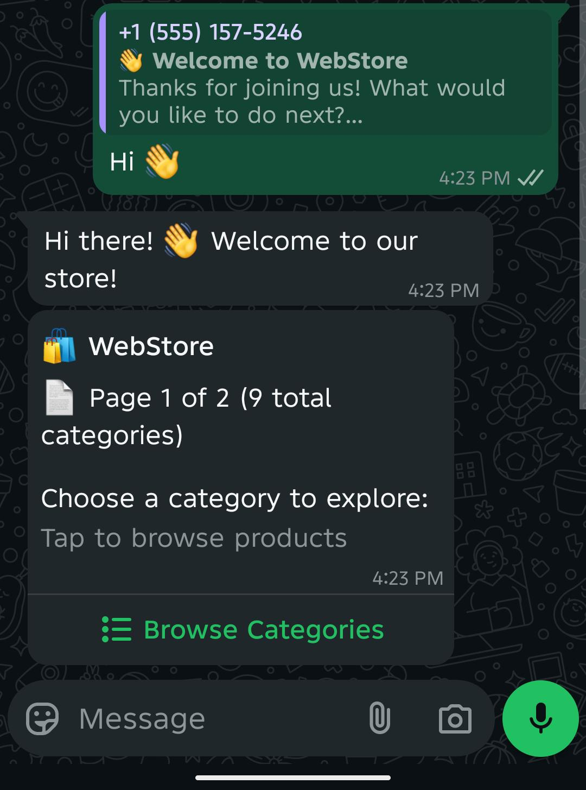
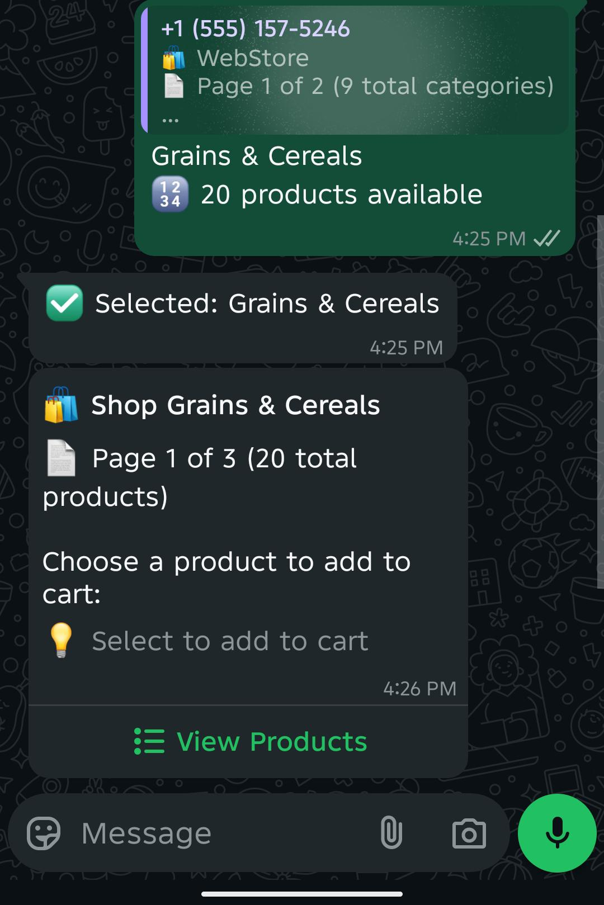
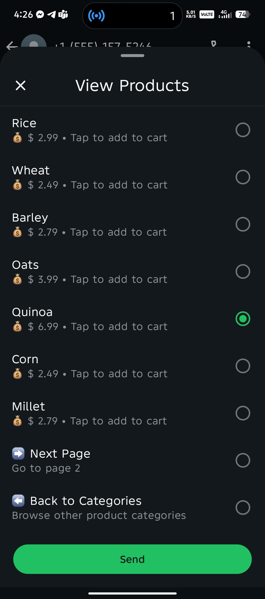
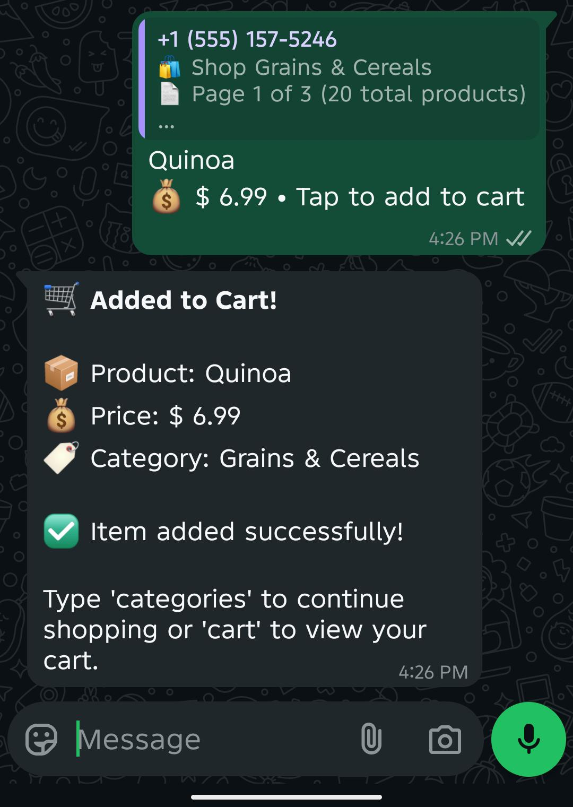
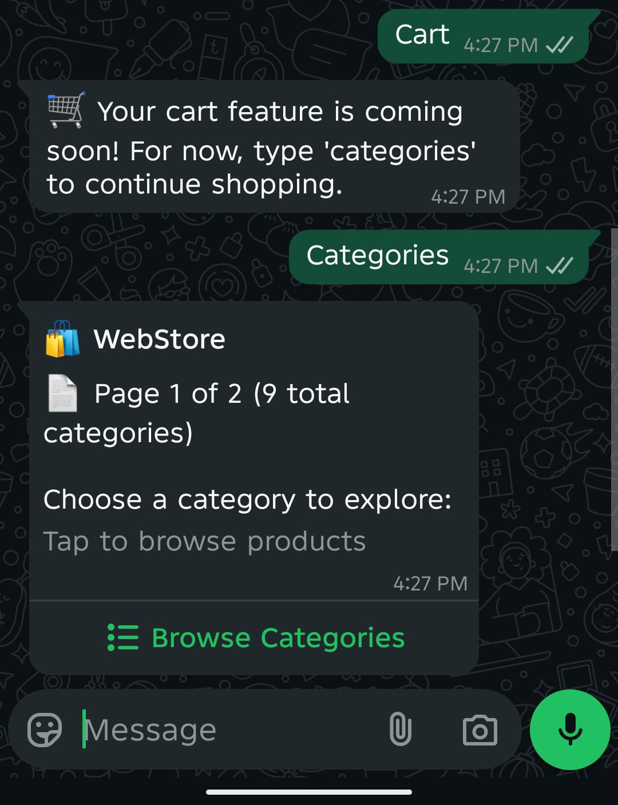

# WhatsApp WebStore Integration - Complete Guide

A comprehensive Spring Boot application that integrates WhatsApp Business API to create an interactive experience directly through WhatsApp messaging.

## 🌟 Overview

This application allows customers to:
- Browse product categories through interactive WhatsApp buttons
- View products within selected categories
- See detailed product information and pricing
- Add items to cart (placeholder implementation)
- Complete shopping experience without leaving WhatsApp

## 🏗️ Architecture

```
┌─────────────────┐    ┌──────────────────┐    ┌─────────────────────┐
│   WhatsApp      │    │   Spring Boot    │    │    PostgreSQL       │
│   Business API  │◄──►│   Application    │◄──►│    Database         │
│                 │    │                  │    │                     │
│ • Send Messages │    │ • Process Logic  │    │ • Categories        │
│ • Receive Hooks │    │ • Handle Buttons │    │ • Products          │
│ • Interactive   │    │ • Database Ops   │    │ • Pricing           │
│   Components    │    │                  │    │ • Currency          │
└─────────────────┘    └──────────────────┘    └─────────────────────┘
         ▲                       ▲
         │                       │
    ┌────▼────┐             ┌────▼────┐
    │  ngrok  │             │Postman  │
    │(Webhook)│             │(Testing)│
    └─────────┘             └─────────┘
```

## 🔗 API Endpoints

### 1. Welcome Message
**Endpoint:** `POST /{version}/{phoneNumberId}/send-welcome-template/messages`

**Example:**
```
POST http://localhost:8080/v22.0/123456789012345/send-welcome-template/messages
Content-Type: application/json

{
    "to": "+919876543210"
}
```

**Response:** Sends welcome message with "Hi 👋" and "Tell me more" buttons

---

### 2. Category Interactive Message
**Endpoint:** `POST /{version}/{phoneNumberId}/send-category-interactive/messages`

**Example:**
```
POST http://localhost:8080/v22.0/123456789012345/send-category-interactive/messages?phone=+919876543210
```

**Response:** Shows up to 3 categories as interactive buttons

---

### 3. Product Interactive Message
**Endpoint:** `POST /{version}/{phoneNumberId}/send-product-interactive/messages`

**Example:**
```
POST http://localhost:8080/v22.0/123456789012345/send-product-interactive/messages?phone=+919876543210&categoryName=Electronics
```

**Response:** Shows products in the specified category

---

### 4. Single Product Details
**Endpoint:** `POST /{version}/{phoneNumberId}/send-one-product-interactive/messages`

**Example:**
```
POST http://localhost:8080/v22.0/123456789012345/send-one-product-interactive/messages?phone=+919876543210&productName=iPhone
```

**Response:** Shows detailed product information with "View Price" button

---

### 5. Product Pricing
**Endpoint:** `POST /{version}/{phoneNumberId}/show-product-price-interactive/messages`

**Example:**
```
POST http://localhost:8080/v22.0/123456789012345/show-product-price-interactive/messages?phone=+919876543210&productName=iPhone
```

**Response:** Shows pricing in INR with "Add to Cart" option

---

### 6. Text Message
**Endpoint:** `POST /{version}/{phoneNumberId}/send-text/messages`

**Example:**
```
POST http://localhost:8080/v22.0/123456789012345/send-text/messages?phone=+919876543210&message=Hello from API
```

**Response:** Sends plain text message

## 🎯 Complete User Flow

### Step-by-Step Experience

#### 1. **Initial Contact**
```
Admin → Postman → Send Welcome Message
User ← WhatsApp ← "Welcome! Choose: [Hi 👋] [Tell me more]"
```


#### 2. **Welcome Interaction**
```
User → WhatsApp → Clicks "Hi 👋"
User ← WhatsApp ← "Welcome message + Category buttons"
```

#### 3. **Category Selection**
```
User → WhatsApp → Clicks "Electronics"
User ← WhatsApp ← "Products: [iPhone] [Samsung] [iPad]"
```

#### 4. **Product Selection**
```
User → WhatsApp → Clicks "iPhone"
User ← WhatsApp ← "Product details + [View Price] [Back]"
```


#### 5. **Pricing Information**
```
User → WhatsApp → Clicks "View Price"
User ← WhatsApp ← "₹99,999.00 + [Add to Cart] [Back]"
```


#### 6. **Cart Addition**
```
User → WhatsApp → Clicks "Add to Cart"
User ← WhatsApp ← "✅ Added to Cart! Type 'cart' to view"
```



## 📈 Performance Considerations
### Rate Limiting
- **WhatsApp Limits**: 1000 messages per second
- **Database Limits**: Use connection pooling
- **API Limits**: Implement request throttling

## 🎯 Future Enhancements

### Planned Featuresshared image (5)
- **Cart Management**: Full shopping cart implementation
- **Payment Integration**: UPI, Credit Card, COD support
- **Order Tracking**: Real-time order status updates
- **User Profiles**: Customer data management
- **Inventory Management**: Stock level tracking

---

## 📝 License

---

## 🙏 Acknowledgments

---

**Happy Coding! 🚀**
